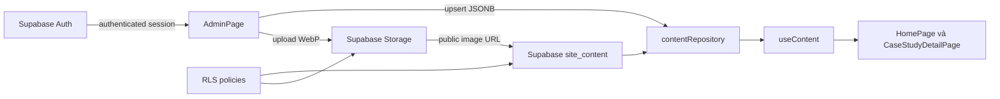

# Hướng dẫn toàn bộ dự án DGM Credential Website

> Tài liệu bảo trì dành cho người phát triển và quản trị nội dung.  
> Cập nhật theo mã nguồn ngày 13/08/2026.

## 1. Tổng quan

Dự án là website credential/landing page của DGM, gồm:

- Landing page public thể hiện năng lực, hành trình, giải thưởng, dịch vụ, case study, đội ngũ và đối tác.
- Trang chi tiết riêng cho từng case study.
- Content Studio tại `/admin` để chỉnh sửa nội dung và hình ảnh.
- Supabase làm backend: Auth, PostgreSQL Database, Storage và Realtime.
- Admin đăng nhập bằng user email/password được tạo thủ công trong Supabase Authentication.

Luồng trang chủ hiện tại:

```text
Header
  → Hero
  → About Us / Press articles
  → Timeline / Our Journey
  → Our Recognition
  → Our Services
  → Case Studies
  → Our Team
  → Partners
  → Footer
```

## 2. Khởi chạy nhanh

### Yêu cầu

- Node.js 20 trở lên được khuyến nghị.
- npm.
- Một Supabase project nếu cần sử dụng Admin và lưu dữ liệu thật.

Kiểm tra môi trường:

```bash
node -v
npm -v
```

### Cài dependency và chạy local

```bash
npm install
npm run dev
```

Website mặc định chạy tại:

```text
http://localhost:5173
```

Các URL quan trọng:

| URL | Chức năng |
|---|---|
| `/` | Landing page |
| `/case-studies/:slug` | Chi tiết case study |
| `/admin` | Content Studio |
| `/?skipPreloader=1` | Bỏ qua preloader khi kiểm tra giao diện |

Build production:

```bash
npm run build
npm run preview
```

Không sửa trực tiếp thư mục `dist`. Đây là kết quả được Vite tạo lại mỗi lần build.

## 3. Công nghệ đang sử dụng

| Công nghệ | Vai trò |
|---|---|
| React 18 | Xây dựng giao diện theo component |
| React DOM | Render React vào trình duyệt |
| Vite 5 | Dev server, bundle và production build |
| React Router DOM 6 | Điều hướng giữa homepage, case study và admin |
| Framer Motion | Animation, scroll progress, timeline và transition |
| Lucide React | Icon dạng SVG |
| Supabase JS 2 | Kết nối Auth, Database, Storage và Realtime |
| PostgreSQL | Lưu nội dung landing page dưới dạng JSONB |
| Supabase Auth | Đăng nhập email/password bằng user được tạo thủ công |
| Supabase Storage | Lưu logo, ảnh bài báo, recognition và case study |
| Supabase Realtime | Thông báo frontend khi nội dung database thay đổi |
| CSS thuần | Hệ thống giao diện chính trong `src/styles/site.css` |
| Tailwind CSS | Đã được cấu hình nhưng hiện không phải hệ thống style chính |
| PostCSS + Autoprefixer | Xử lý CSS khi build |

Danh sách và version dependency chính thức nằm trong `package.json` và `package-lock.json`.

## 4. Cấu trúc thư mục

```text
dgm-credential-react/
├─ public/
│  ├─ favicon.svg
│  └─ hero.jpg
├─ reference/
│  └─ Các ảnh tham khảo thiết kế, không được render trực tiếp
├─ src/
│  ├─ components/          Component giao diện
│  ├─ data/siteData.js     Nội dung mặc định/fallback
│  ├─ hooks/useContent.js  Đưa dữ liệu repository vào React state
│  ├─ lib/supabase.js      Khởi tạo Supabase browser client
│  ├─ pages/               Home, case detail và admin
│  ├─ services/            Auth và content repository
│  ├─ styles/site.css      Toàn bộ style và responsive
│  ├─ App.jsx              Khai báo route
│  └─ main.jsx             Điểm khởi động React
├─ supabase/migrations/
│  └─ SQL schema, RLS, Storage policy và Auth Hook
├─ .env.example            Mẫu biến môi trường
├─ netlify.toml            Build và SPA redirect cho Netlify
├─ vercel.json             SPA rewrite cho Vercel
├─ vite.config.js          Cấu hình Vite
└─ package.json
```

### Vai trò các component chính

| File | Chức năng |
|---|---|
| `Header.jsx` | Logo, navigation desktop/mobile và trạng thái khi scroll |
| `Hero.jsx` | Hero background hoặc award visual mặc định |
| `PressRoom.jsx` | Các thẻ bài báo nghiêng, logo nguồn và popup đọc bài |
| `MilestoneRail.jsx` | Timeline uốn lượn, badge DGM chạy theo scroll |
| `RecognitionShowcase.jsx` | Các thẻ recognition desktop và stack mobile |
| `CaseStudyGallery.jsx` | Filter category, kéo ngang và nút điều hướng case |
| `CaseStudyCard.jsx` | Card và visual fallback của case study |
| `TeamScroll.jsx` | Sơ đồ team gọn và nội dung department |
| `PartnerLogoMarquee.jsx` | Ba dòng logo chạy xen kẽ trái/phải/trái |
| `Footer.jsx` | Footer gọn: contact, address, social và admin link |
| `SiteExperience.jsx` | Thanh progress ở đầu trang |
| `Preloader.jsx` | Màn hình tải xuất hiện một lần trong session |

## 5. Kiến trúc và luồng dữ liệu



### Khi khách truy cập website

1. `main.jsx` khởi tạo React và `BrowserRouter`.
2. `App.jsx` chọn page theo URL.
3. `useContent()` dùng dữ liệu mặc định để render ngay.
4. `contentRepository.loadAll()` đọc `site_content` từ Supabase.
5. Cache được cập nhật và phát event `dgm-content-updated`.
6. Component render lại với dữ liệu cloud.
7. Realtime lắng nghe thay đổi tiếp theo của bảng.

Nếu Supabase chưa được cấu hình hoặc database chưa có row, landing page vẫn hiển thị nội dung mặc định trong `src/data/siteData.js`. Admin sẽ không thể đăng nhập/lưu dữ liệu cho tới khi cấu hình Supabase hoàn chỉnh.

### Khi admin lưu nội dung

1. Admin đăng nhập bằng email/password của user được tạo thủ công.
2. Supabase trả session nếu email/password đúng.
3. Admin sửa nội dung và bấm Save.
4. Repository dùng `upsert` để ghi cả object/array vào row tương ứng.
5. RLS chỉ cho role `authenticated` ghi dữ liệu.
6. Database phát Realtime event để trang public cập nhật.

## 6. Route và anchor

Route được khai báo trong `src/App.jsx`:

```jsx
<Route path="/" element={<HomePage />} />
<Route path="/case-studies/:slug" element={<CaseStudyDetailPage />} />
<Route path="/admin" element={<AdminPage />} />
```

Anchor navigation trên homepage:

| Menu | Anchor |
|---|---|
| About Us | `#about` |
| Our Journey | `#milestones` |
| Recognition | `#recognition` |
| Services | `#services` |
| Case Studies | `#case-studies` |
| Our Team | `#team` |
| Partners | `#partners` |
| Contact | `#contact` |

Khi đổi `id` của section phải đổi link tương ứng trong `Header.jsx`.

## 7. Mô hình dữ liệu Supabase

### Bảng `public.site_content`

Mỗi nhóm nội dung là một row:

| Cột | Kiểu | Ý nghĩa |
|---|---|---|
| `key` | text, primary key | Tên nhóm nội dung |
| `value` | jsonb | Object hoặc array nội dung |
| `updated_at` | timestamptz | Thời điểm cập nhật |
| `updated_by` | uuid | ID user cập nhật gần nhất |

Các `key` hợp lệ:

| Key | Dạng dữ liệu | Nội dung |
|---|---|---|
| `site_settings` | object | Brand, Hero, contact và social |
| `page_content` | object | Section label, menu và các text dùng chung |
| `milestones` | array | Timeline |
| `press_articles` | array | Bài báo trong About Us |
| `recognitions` | array | Giải thưởng/ghi nhận |
| `services` | array | Dịch vụ |
| `partners` | array | Partner/client logo |
| `case_studies` | array | Case study |
| `team_members` | array | Department/team |
| `process_steps` | array | Dữ liệu process dự phòng, hiện không render trên homepage |

Các key này được giới hạn bằng `CHECK` trong migration. Nếu tạo collection mới, phải cập nhật cả SQL và repository.

### Bucket `site-assets`

- Bucket public để ảnh landing page có thể hiển thị không cần đăng nhập.
- Giới hạn file: 8 MB.
- Các MIME type cho phép: JPEG, PNG, WebP, GIF và SVG.
- Chỉ user công ty đã xác thực mới được upload/update/delete.
- File upload từ Admin được chuyển sang WebP, cạnh dài tối đa 1800 px, quality `0.84`.
- Path hiện tại có dạng:

```text
homepage/YYYY-MM-DD/UUID.webp
```

Lưu ý: nút Remove image trong Admin chỉ xóa URL khỏi nội dung đang sửa. Nó chưa xóa object cũ trong Storage. Định kỳ vào Storage > `site-assets` để xóa các file không còn được dùng.

## 8. Cấu trúc dữ liệu nội dung

### `site_settings`

Các field đang được dùng trực tiếp:

```js
{
  companyName,
  companyLogo,
  eyebrow,
  heroTitle,
  heroSecondTitle,
  heroDescription,
  heroBackground,
  heroBackgroundPosition,
  contactEmail,
  hotline,
  address,
  footerTagline,
  linkedinUrl,
  facebookUrl,
  youtubeUrl
}
```

Một số field cũ như `heroPdfUrl`, CTA, map và stats vẫn còn trong dữ liệu mặc định nhưng không được layout hiện tại render đầy đủ. Chỉ chỉnh chúng trong code không làm chúng tự xuất hiện trên website.

### `page_content`

Các nhóm chính:

- `sectionLabels`: headline nhỏ ở góc trên trái mỗi section.
- `ui`: tên menu, nhãn nguồn báo, đọc bài và filter case.
- `about`: title và intro của newsroom.
- `team`: tên/nhãn ở phần trung tâm team và nhãn số người.
- `contact`: copyright và tên link Admin.

Các nhóm `milestones`, `recognition`, `services`, `partners`, `cases`, `process`, `data` còn một số text từ layout cũ. Homepage content-only hiện không render toàn bộ các title/intro này.

### Milestone

```js
{
  id: 'milestone-2026',
  year: '2026',
  title: 'Tiêu đề cột mốc',
  text: 'Dòng 1\nDòng 2'
}
```

Dùng `\n` để tạo nhiều dòng trong nội dung timeline.

### Press article

```js
{
  id,
  year,
  title,
  source,
  description,
  image,
  logo,
  url
}
```

- `image`: ảnh chụp/trang bìa bài báo.
- `logo`: logo tòa soạn hiển thị bên phải.
- `url`: link đầy đủ tới bài báo; dùng `#` hoặc để trống nếu chưa có.
- Có thể thêm nhiều bài; góc nghiêng và vị trí được tạo theo index trong `PressRoom.jsx`.

### Recognition

```js
{
  id,
  year,
  title,
  subtitle,
  description,
  image
}
```

Số `01`, `02`... được sinh tự động theo thứ tự array, không lưu riêng trong database.

### Service

```js
{
  id,
  no: '01',
  title: 'Digital Strategy',
  text: '',
  tags: ['Media Strategy Planning', 'Media Buying']
}
```

Trong Admin, nhập `tags` cách nhau bằng dấu phẩy. Layout hiện được tối ưu cho năm service; thêm nhiều service vẫn render nhưng nên kiểm tra lại grid desktop/mobile.

### Case study

```js
{
  id,
  slug,
  title,
  category,
  year,
  image,
  summary,
  objective,
  challenge,
  solution,
  result
}
```

- `slug` được tạo từ title khi tạo mới.
- Không nên đổi slug sau khi đã chia sẻ URL.
- `category` tạo filter tự động trong Case Studies.
- Trang chi tiết tìm case bằng slug tại `/case-studies/:slug`.

### Team member/department

```js
{
  id,
  role,
  count: '10',
  detail,
  tags: ['Creative direction', 'Content']
}
```

`TeamScroll.jsx` chọn icon dựa trên từ khóa trong `role`. Khi thêm một role hoàn toàn mới, kiểm tra visual/icon fallback.

### Partner

```js
{
  id,
  name,
  group,
  logo
}
```

Nếu không có `logo`, component dùng `name` làm wordmark. Danh sách được chia thành ba dòng và chạy theo hướng trái/phải/trái.

## 9. Hướng dẫn tạo và kết nối Supabase

Quy trình chi tiết nằm trong `HUONG_DAN_DEPLOY_VERCEL_SUPABASE.md`. Tóm tắt:

### Bước 1: Tạo project

1. Đăng nhập [Supabase Dashboard](https://supabase.com/dashboard).
2. Chọn New project, region phù hợp và database password mạnh.
3. Chờ project khởi tạo hoàn tất.

### Bước 2: Chạy hai migration theo thứ tự

```text
supabase/migrations/202608130001_landing_page_backend.sql
supabase/migrations/202608140001_manual_admin_accounts.sql
```

Migration cuối thay RLS domain cũ bằng policy cho role `authenticated`.

### Bước 3: Tắt public signup và hook cũ

1. Authentication settings: tắt `Allow new users to sign up`.
2. Giữ Email/password provider hoạt động.
3. Authentication > Hooks: tắt Before User Created Hook cũ nếu từng bật.
4. Không cần custom SMTP hoặc Auth Redirect URLs cho `signInWithPassword`.

### Bước 4: Tạo user thủ công

1. Authentication > Users > Add user > Create new user.
2. Nhập email và mật khẩu mạnh.
3. Confirm user trực tiếp trong Dashboard.
4. Không dùng Send invitation vì không có SMTP.

User vừa được tạo có thể đăng nhập Content Studio ngay. Không cần bảng allowlist hay SQL cấp quyền riêng.

### Bước 5: Lấy Project URL và Publishable Key

Vào Project Settings > API, lấy:

- Project URL.
- Publishable key, thường bắt đầu bằng `sb_publishable_`.

Không dùng hoặc đưa `service_role`, secret key, database password vào frontend.

### Bước 6: Tạo `.env.local`

Copy `.env.example` thành `.env.local`:

```env
VITE_SUPABASE_URL=https://YOUR_PROJECT.supabase.co
VITE_SUPABASE_PUBLISHABLE_KEY=sb_publishable_YOUR_KEY
```

Ý nghĩa:

| Biến | Ý nghĩa |
|---|---|
| `VITE_SUPABASE_URL` | URL API của project |
| `VITE_SUPABASE_PUBLISHABLE_KEY` | Key frontend được bảo vệ bởi RLS |

Sau khi sửa `.env.local`, phải dừng và chạy lại `npm run dev`.

Vite chỉ đưa biến bắt đầu bằng `VITE_` vào browser bundle. Vì vậy tuyệt đối không đặt secret key trong một biến `VITE_*`.

### Bước 7: Đăng nhập lần đầu

1. Mở `/admin`.
2. Nhập email và mật khẩu của user đã tạo.
3. Bấm Đăng nhập.
4. Hệ thống xác thực password và tạo session.

Nếu database còn trống, trang public vẫn dùng dữ liệu mặc định. Trong Admin có thể bấm Restore default content để ghi toàn bộ default lên Supabase. Chỉ dùng nút này khi khởi tạo hoặc khi thật sự muốn ghi đè nội dung hiện tại.

Tài liệu chính thức: [JavaScript signInWithPassword](https://supabase.com/docs/reference/javascript/auth-signinwithpassword).

## 10. Auth và phân quyền

Hệ thống có ba lớp bảo vệ:

1. Public signup bị tắt; user chỉ được tạo thủ công trong Dashboard.
2. `authService.js` xác thực email/password.
3. RLS chỉ cho role `authenticated` ghi Database/Storage.

### Quyền hiện tại

| Đối tượng | Đọc nội dung | Sửa nội dung | Upload ảnh |
|---|---:|---:|---:|
| Khách chưa đăng nhập | Có | Không | Không |
| User chưa đăng nhập | Có | Không | Không |
| User Auth đã đăng nhập | Có | Có | Có |

Email có thể thuộc bất kỳ domain nào. Muốn thu hồi quyền, ban hoặc xóa user trong Authentication > Users.

Tài liệu chính thức: [Row Level Security](https://supabase.com/docs/guides/database/postgres/row-level-security).

## 11. Sử dụng Content Studio

### Brand, Hero và Footer

Cho phép chỉnh:

- Company name và logo.
- Hero background và background position.
- Hero eyebrow/title/description.
- Email, hotline và address.
- Footer tagline.
- LinkedIn, Facebook và YouTube URL.

Nếu có Hero background, `Hero.jsx` ưu tiên ảnh và ẩn award composition mặc định.

### Homepage copy

Cho phép chỉnh:

- Tên section góc trên trái.
- Tên navigation.
- Tiêu đề/mô tả newsroom.
- Nhãn hiển thị team.
- Copyright và Admin label.

### Các collection

Admin có thể thêm/sửa/xóa:

- Milestones.
- Press articles.
- Recognitions.
- Services.
- Case studies.
- Team departments.
- Partner logos.

Mỗi lần Save sẽ ghi lại toàn bộ array của collection. Vì vậy không nên để hai admin cùng sửa một collection trong cùng thời điểm; lần lưu sau cùng sẽ ghi đè array trước đó.

## 12. Chỉnh sửa nội dung trong code

### Đổi nội dung fallback

Sửa `src/data/siteData.js`.

Fallback chỉ được dùng khi:

- Supabase chưa cấu hình.
- Database chưa có row tương ứng.
- Admin bấm Restore default content.

Nếu database đã có row, sửa `siteData.js` sẽ không ghi đè nội dung đang lưu trên cloud.

### Thêm field vào một loại nội dung có sẵn

Ví dụ thêm `client` cho Case Study:

1. Thêm `client` trong các case mặc định tại `siteData.js`.
2. Thêm field vào `collectionDefinitions` của `AdminPage.jsx`.
3. Render `item.client` trong `CaseStudyCard.jsx` hoặc `CaseStudyDetailPage.jsx`.
4. Build và test.

Không cần thay schema PostgreSQL vì `value` là JSONB.

### Thêm collection mới

Ví dụ thêm `testimonials`:

1. Tạo `defaultTestimonials` trong `siteData.js`.
2. Thêm `testimonials` vào object `defaults` của `contentRepository.js`.
3. Thêm getter/saver trong repository.
4. Thêm state và refresh trong `useContent.js`.
5. Thêm `collectionDefinition` trong `AdminPage.jsx`.
6. Tạo component hiển thị.
7. Render component trong `HomePage.jsx`.
8. Thêm `'testimonials'` vào `CHECK (key in (...))` bằng migration SQL mới.
9. Chạy migration trên Supabase production.

Không sửa migration đã chạy trên production nếu dự án đã có người dùng. Nên tạo file migration mới có timestamp cao hơn.

### Thêm section mới trên homepage

1. Tạo component trong `src/components`.
2. Thêm section đúng vị trí trong `HomePage.jsx`.
3. Đặt `id` không trùng.
4. Thêm navigation trong `Header.jsx` nếu cần.
5. Thêm label vào `defaultPageContent.sectionLabels`.
6. Thêm field chỉnh sửa trong `copyGroups` của Admin.
7. Thêm CSS desktop và mobile.
8. Nếu có collection mới, thực hiện các bước ở mục trên.

## 13. Chỉnh sửa giao diện và animation

Style chính nằm trong:

```text
src/styles/site.css
```

Các biến màu cơ bản ở `:root`:

```css
--navy: #04182c;
--navy-2: #08243e;
--blue: #087fc2;
--cyan: #49d3ef;
--ink: #0a1725;
--muted: #627282;
--line: #cbd5dc;
--paper: #ffffff;
```

### Quy tắc khi sửa CSS

- Tìm đúng class bằng `rg "ten-class" src`.
- File CSS có nhiều lớp override theo lịch sử thiết kế; rule nằm phía sau có độ ưu tiên cao hơn khi selector tương đương.
- Các rule flow hiện tại nằm gần comment `2026 EDITORIAL CREDENTIAL FLOW`.
- Các rule Admin hiện tại nằm gần comment `Content Studio`.
- Luôn test ở desktop, tablet và mobile.
- Không lạm dụng `!important`; hiện một số section dùng nó để nối background nên cần kiểm tra cascade trước khi xóa.
- Tôn trọng `prefers-reduced-motion`; các component Framer Motion chính đã dùng `useReducedMotion`.

### Framer Motion

Được dùng cho:

- Hero entrance.
- Press article popup.
- Timeline active/fade và badge DGM.
- Recognition mobile stack.
- Scroll progress.
- Reveal animation.

Khi animation gây giật:

- Ưu tiên animate `transform` và `opacity`.
- Hạn chế animate width/height hoặc filter lớn.
- Giảm số phần tử motion chạy vô hạn.
- Kiểm tra mobile thật, không chỉ Chrome responsive mode.

## 14. Quản lý hình ảnh

### Upload từ Admin

- File gốc tối đa 8 MB.
- Browser resize cạnh dài tối đa 1800 px.
- Chuyển sang WebP trước khi upload.
- URL public được lưu vào JSONB.

### Dán URL thủ công

Admin cũng cho phép dán URL/path. URL này không được copy vào Supabase Storage, vì vậy phải đảm bảo nguồn ảnh ổn định và cho phép hotlink.

### Ảnh local

Đặt file public vào `public/`, sau đó dùng đường dẫn:

```text
/ten-anh.webp
```

Không import ảnh trong `public` bằng relative path từ component.

### Khuyến nghị

- Hero: WebP, rộng khoảng 1920–2560 px trước tối ưu.
- Case study: tỷ lệ ngang đồng nhất.
- Press article/recognition: tỷ lệ gần 4:5.
- Logo: SVG hoặc PNG nền trong suốt.
- Luôn thêm title/description có nghĩa để alt text không bị rỗng.

## 15. Supabase Realtime

Migration thêm `site_content` vào publication `supabase_realtime`.

Frontend subscribe bằng:

```js
supabase
  .channel('site-content-changes')
  .on('postgres_changes', {
    event: '*',
    schema: 'public',
    table: 'site_content'
  }, callback)
```

Realtime giúp tab public đang mở tải lại nội dung sau khi Admin save. Nếu không hoạt động:

1. Kiểm tra migration đã chạy.
2. Kiểm tra bảng có trong publication.
3. Kiểm tra RLS SELECT.
4. Kiểm tra browser console và Network > WS.

## 16. Deploy

### Vercel

1. Import repository.
2. Framework preset: Vite.
3. Build command: `npm run build`.
4. Output directory: `dist`.
5. Thêm bốn biến môi trường Supabase.
6. Deploy.
7. Thêm URL production `/admin` vào Supabase Redirect URLs.

`vercel.json` đã rewrite mọi route về `index.html`, cần thiết cho React Router.

### Netlify

`netlify.toml` đã có:

```toml
[build]
  command = "npm run build"
  publish = "dist"

[[redirects]]
  from = "/*"
  to = "/index.html"
  status = 200
```

Thêm biến môi trường trong Site configuration > Environment variables và cấu hình Redirect URL trong Supabase.

### Checklist trước deploy

- `npm run build` thành công.
- Không có secret key trong source hoặc Git.
- `.env.local` không được commit.
- Magic link local hoạt động.
- Magic link production quay về đúng `/admin`.
- User ngoài domain không thể đăng nhập/chỉnh sửa.
- Public xem được ảnh Storage.
- Test menu, popup báo, timeline, case filter và mobile.

## 17. Backup và khôi phục

### Backup nội dung

Trong Supabase Table Editor có thể export bảng `site_content` ra CSV. Vì `value` là JSONB, cần giữ nguyên nội dung JSON.

Có thể kiểm tra bằng SQL:

```sql
select key, updated_at, jsonb_pretty(value)
from public.site_content
order by key;
```

### Backup Storage

Database chỉ lưu URL, không chứa binary của ảnh. Cần backup riêng bucket `site-assets` nếu nội dung quan trọng.

### Restore default content

Nút Restore default content trong Admin sẽ upsert toàn bộ dữ liệu mặc định từ `siteData.js`. Nó có thể ghi đè thay đổi thật, vì vậy nên export backup trước khi dùng trên production.

## 18. Xử lý lỗi thường gặp

### Admin báo chưa cấu hình Supabase

Nguyên nhân:

- Thiếu `.env.local`.
- Sai tên biến.
- Chưa restart Vite.

Kiểm tra:

```env
VITE_SUPABASE_URL=
VITE_SUPABASE_PUBLISHABLE_KEY=
```

### Email/password không đăng nhập được

- Kiểm tra user đã được tạo trong Authentication > Users.
- Kiểm tra password.
- Kiểm tra user đã confirmed.
- Kiểm tra frontend đang trỏ đúng Supabase project.

### Save báo Row Level Security violation

- Session đã hết hạn.
- Migration policy authenticated chưa chạy hoặc session đã hết hạn.
- Migration/policy chưa chạy đầy đủ.
- Đăng xuất rồi đăng nhập lại để lấy JWT mới.

### Upload ảnh thất bại

- File lớn hơn 8 MB.
- File không phải ảnh.
- Bucket `site-assets` chưa tồn tại.
- Storage policy chưa chạy.
- User chưa xác thực.

### Homepage vẫn hiện dữ liệu cũ

- Row trong Supabase đang ghi đè fallback.
- Kiểm tra `site_content` trong Table Editor.
- Hard refresh browser.
- Kiểm tra Realtime publication.
- Kiểm tra console xem request Supabase có lỗi không.

### Case detail báo not found

- Slug URL không khớp `item.slug`.
- Case chưa được lưu vào Supabase.
- Slug bị đổi sau khi link đã được chia sẻ.

### Build báo chunk lớn hơn 500 kB

Đây là warning, không làm build thất bại. Nếu cần tối ưu tiếp:

- Lazy-load `AdminPage`.
- Lazy-load `CaseStudyDetailPage`.
- Tách vendor chunk.
- Kiểm tra component/asset không còn sử dụng.

## 19. Bảo mật cần nhớ

- Publishable key có thể xuất hiện trong frontend nếu RLS đúng.
- Tuyệt đối không đưa service role key vào frontend.
- Không tắt RLS để sửa lỗi tạm thời trên production.
- Bật MFA cho tài khoản quản trị Supabase organization.
- Tắt public signup và chỉ tạo user thủ công.
- Giữ database password trong password manager.
- Review user trong Authentication định kỳ.
- Nếu nhân sự nghỉ việc, xóa hoặc ban user Supabase Auth.
- Backup database và Storage trước thay đổi lớn.
- Tạo migration mới cho thay đổi schema/policy; không sửa lịch sử migration production.

## 20. Git và quy trình sửa an toàn

Trước khi sửa:

```bash
git status
git pull
```

Sau khi sửa:

```bash
npm run build
git diff --check
git status
```

Không commit:

- `.env`
- `.env.local`
- Database password.
- Service role/secret key.

Nên commit:

- Migration SQL mới.
- Thay đổi source.
- `.env.example` nếu có biến mới nhưng không điền giá trị thật.
- Tài liệu cập nhật.

## 21. Tài liệu chính thức

- [React](https://react.dev/)
- [Vite](https://vite.dev/guide/)
- [React Router](https://reactrouter.com/)
- [Framer Motion](https://motion.dev/docs/react)
- [Lucide React](https://lucide.dev/guide/packages/lucide-react)
- [Supabase JavaScript client](https://supabase.com/docs/reference/javascript/initializing)
- [Supabase React quickstart](https://supabase.com/docs/guides/getting-started/quickstarts/reactjs)
- [Supabase password Auth](https://supabase.com/docs/guides/auth/passwords)
- [Supabase Auth users](https://supabase.com/docs/guides/auth/users)
- [Supabase Row Level Security](https://supabase.com/docs/guides/database/postgres/row-level-security)
- [Supabase Storage access control](https://supabase.com/docs/guides/storage/security/access-control)
- [Supabase Realtime](https://supabase.com/docs/guides/realtime)

## 22. Danh sách file nên đọc đầu tiên khi tiếp quản

Theo thứ tự:

1. `HUONG_DAN_DU_AN.md` — tài liệu này.
2. `src/pages/HomePage.jsx` — luồng và thứ tự section.
3. `src/data/siteData.js` — model và default content.
4. `src/services/contentRepository.js` — luồng Database/Storage/Realtime.
5. `src/services/authService.js` — đăng nhập email/password.
6. `src/pages/AdminPage.jsx` — form chỉnh sửa.
7. `supabase/migrations/` — schema backend và policy cho Auth user.
8. `src/styles/site.css` — visual và responsive.

Khi thay đổi một tính năng, luôn kiểm tra đủ ba lớp:

```text
Data model → Admin editor → Public component
```

Nếu thay đổi quyền hoặc loại dữ liệu mới, kiểm tra thêm:

```text
Migration SQL → RLS → Storage policy → Environment variables
```
